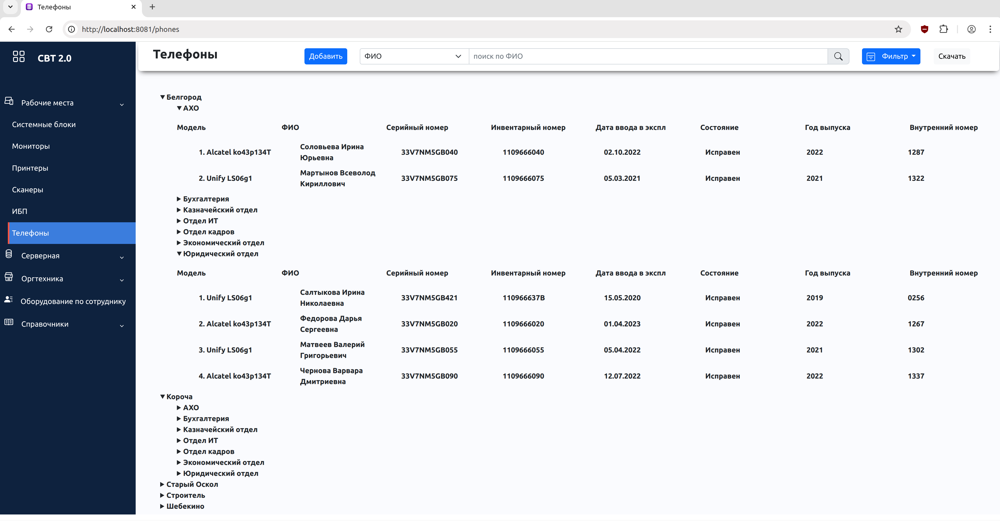
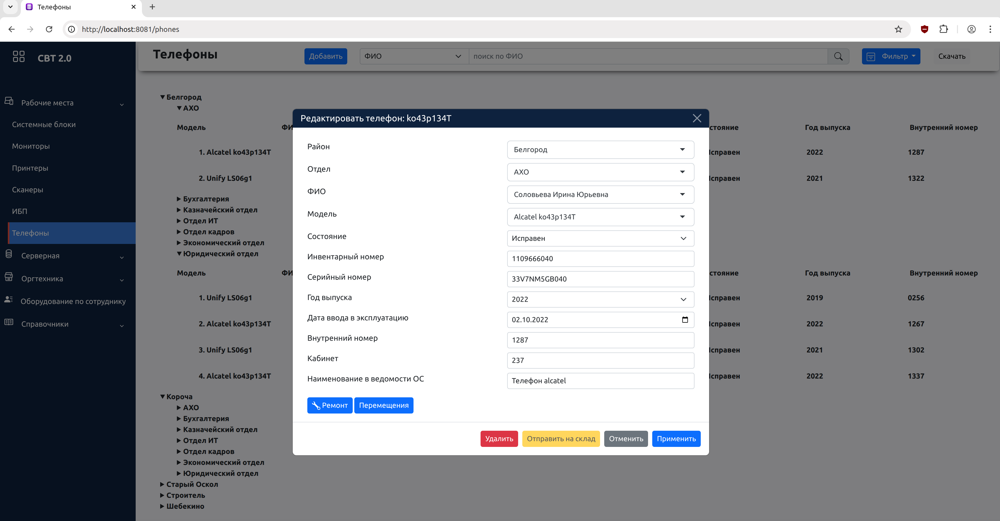

# Monitoring. База СВТ

Веб-приложение для учёта и мониторинга средств вычислительной и офисной техники, разработанное для внутренних нужд государственного учреждения.
Система предназначена для централизованного хранения информации об оборудовании, отслеживания его состояния, перемещений и ответственных лиц.
Проект реализован как fullstack-приложение с использованием Java и Spring Boot.

## Интерфейс приложения



## Назначение системы

Приложение решает следующие задачи:

- Учёт компьютерной и офисной техники
- Хранение технических характеристик оборудования
- Отслеживание статуса (в эксплуатации, на ремонте, списано и т.д.)
- Назначение ответственных сотрудников
- История изменений и обновлений данных
- Удобный поиск и фильтрация записей

## Технологии

Backend:
- Java 11
- Spring Boot
- Spring MVC
- Spring Data JPA
- Hibernate
- Maven

Frontend:
- Thymeleaf
- JavaScript
- Bootstrap v.5

Database & Infrastructure:
- MySQL
- Docker / Docker Compose (контейнеризация и оркестрация)

Сборка:
- Maven


## Архитектура и Инфраструктура

Проект реализован на базе микросервисной архитектуры:
- **Eureka Server**: Discovery-сервис для регистрации микросервисов.
- **Monitoring Service**: Основной модуль учета техники.
- **Employee Service**: Сервис управления данными сотрудников.

**Инфраструктурные особенности:**
- **Liquibase**: Автоматическое управление миграциями БД.
- **Docker Compose**: Полная оркестрация всей инфраструктуры (БД + Сервисы) одной командой.
- **Spring Data JPA**: Абстракция над данными для быстрой и надежной работы с MySQL.

### Основные принципы:
- Разделение ответственности (SRP)
- Чёткое разграничение слоёв
- Использование DTO (если используются)
- Работа с JPA через Spring Data
- Обработка исключений на уровне контроллеров

---

## Основной функционал

- Создание карточек оборудования
- Редактирование информации
- Удаление записей
- Просмотр списка техники
- Поиск и фильтрация
- Работа со статусами оборудования
- Валидация вводимых данных

---

## Особенности реализации

- Использование ORM (Hibernate) для работы с БД
- Конфигурация через application.properties
- Обработка ошибок и пользовательских сценариев
- Поддержка расширяемой структуры сущностей

## Запуск через Docker

Для запуска проекта одной командой:

```bash
git clone https://github.com/oalikin88/monitoring.git
cd ./monitoring
docker compose up --build
Приложение будет доступно по адресу:
http://localhost:8081/phones

